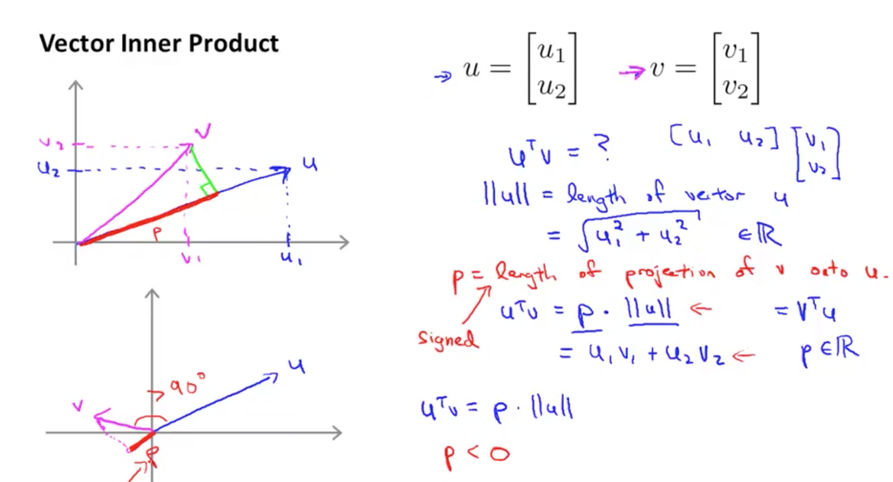

# Linear Algebra Review

* [What exactly is a vector?](#What-exactly-is-a-vector?)
* [Adding and Multiplying Vectors](#Adding-and-Multiplying-Vectors)
* [Spans and Bases](#Spans-and-Bases)
* [Linear Transformations and Matrices](#Linear-Transformations-and-Matrices)
* [Matrix-Vector Multiplication](#Matrix-Vector-Multiplication)
* [Matrix-Matrix Multiplication](#Matrix-Matrix-Multiplication)
* [Determinant](#Determinant)
* [Inverse Matrices, Rank](#Inverse-Matrices,-Rank)
* [ Change of Basis](#-Change-of-Basis)
* [Orthogonal Complement](#Orthogonal-Complement)
* [Orthonormal Bases](#Orthonormal-Bases)
* [Projecting vectors onto subspaces with orthonormal bases](#Projecting-vectors-onto-subspaces-with-orthonormal-bases)
* [Using Orthogonal Change-of-Basis Matrix to find Transformation Matrix](#Using-Orthogonal-Change-of-Basis-Matrix-to-find-Transformation-Matrix)
* [Gram-Schmidt Process - Finding Orthonormal Basis for any given Basis](#Gram-Schmidt-Process---Finding-Orthonormal-Basis-for-any-given-Basis)
* [Eigenvalues and Eigenspaces and Eigenvectors](#Eigenvalues-and-Eigenspaces-and-Eigenvectors)
* [Eigenvalues and Eigenvectors make for good coordinate systems](#Eigenvalues-and-Eigenvectors-make-for-good-coordinate-systems)
* [Vector Inner Product (aka Dot Product):](#Vector-Inner-Product--aka-Dot-Product-:)
* [Vector Cross Product](#Vector-Cross-Product)
* [Identity Matrix](#Identity-Matrix)
* [Transpose Matrix](#Transpose-Matrix)
* [Solving systems of Linear Equations](#Solving-systems-of-Linear-Equations)
* [Summations using matrices](#Summations-using-matrices)
* [Example: Portfolio Matrix Algebra](#Example:-Portfolio-Matrix-Algebra)

## What exactly is a vector?

* basic component of linear algebra
* physics: a vector is a direction and length/magnitude
* comp sci: a vector is a list of numbers (data records)
* math: general: a vector is anything where there are sensible notions of 
    * adding two vectors
    * multiplying a vector by a number
* conceptually useful to think of vectors as an arrow
    * on a coordinate system
    * rooted at the origin

## Adding and Multiplying Vectors

#### Adding vectors

* imagine two vectors
    * each rooted at the origin
* move the tail of one vector
* to the tip of the other vector
* the SUM is where the tip of the moved vector ends up
    * i.e. traveling along the first vector
    * then the second vector
    * where you end up is the sum
* (usually the only time we let vectors stray from the origin)

#### Multiplying vectors

* "scaling"
* "stretches out" the vector by the given number
* number aka a "scalar"

## Spans and Bases

* think of vector coordinates as SCALARS
* that scale up a "basis vector"
* e.g. `^i` and `^j` are **standard basis** vectors 
    * for the x-y coordinate system
    * every vector in x-y are scaled up versions
    * of the basis vectors
* numeric descriptions of vectors depends on
    * an implicit choice of basis vectors
* **Linear combination**: scaling and adding together two vectors
* most basis vectors can be linearly combined
    * to generate vectors
    * that reach everywhere in the coordinate system
    * this is called the **SPAN** of the basis vectors
    * **SPAN**: set of all linear combinations
* UNLESS they're the zero vector
* OR they're linearly dependent (on the same line)
* in 3D space, the SPAN of two vectors 
    * is a 2D plane
    * cutting thru the origin of 3d space
* in 3D space, the SPAN of three vectors
    * is all of 3D space
    * UNLESS the third vector is already sitting
        * on the span of the first two vectors
        * i.e. adding the third vector doesn't give access
        * to any new vectors
        * the third vector is **Linearly dependent** on the other two
* **Linearly Dependent**: when you have multiple vectors 
    * and one can be removed
    * without reducing the span
    * i.e. one of the vectors can be expressed 
        * as a linear combination of other vectors
* **Basis**: the basis of a vector space is 
    * the set of linearly independent vectors
    * that SPAN the full space
    * all vectors that are members of the vector space...
        * can be defined as a linear combination
        * of the basis vectors
    * **Standard Basis**
        * `^i` and `^j`

## Linear Transformations and Matrices

* "transformation" == function
* "linear": 
    * lines remain lines
    * origin remains at origin
    * keeps grid lines parallel and evenly spaced
* only need to understand the linear transformation of basis vectors
    * in order to understand the linear transformation of all vectors
    * since all vectors are linear combinations of basis vectors
    * the linear combination is preserved after the transformation

    
Example:

    v = [ -1 ] 
        [ 2  ]

      = -1^i + 2^j
        
    after transformation:

    ^i = [  1 ]    ^j = [ 3 ]
         [ -2 ]         [ 0 ]

    v = -1^i + 2^j

      = -1 * [  1 ] + 2 * [ 3 ]     <--- this is matrix multiplication
             [ -2 ]       [ 0 ]

      = [ 5 ]
        [ 2 ]

      = [ ^i ^j ] * v               <--- matrix multiplication form
                                         matrix always on the left
      = [ 1   3 ] * [ -1 ]               like the "function" operator
        [ -2  0 ]   [  2 ]

      = [ 5 ]
        [ 2 ]

* Therefore a matrix describes a linear transformation function
* The cols of the matrix are where the basis vectors end up after the transformation
* this allows you to visualize a transformation
    * by visualizing how the basis vectors are transformed
* if the transformed basis vectors are linearly dependent..
    * then the transformation "squishes" the span 
    * into a lower dimension 
        * e.g. the span of all 2d space squished onto a 1D line
* matrix - matrix multiplication is like applying two transformations
    * the resulting matrix is like applying a single transformation...
    * equivalent to the two

## Matrix-Vector Multiplication

    A * w = b

Imagine the matrix A is a set of column vectors:

        [ |   |  ]
    A = [ v1  v2 ] 
        [ |   |  ]

    v1, v2: the coordinates of the standard basis vectors 
            ^i and ^j, after applying the transformation A

    ^i = [ 1 ]      ^j = [ 0 ]
         [ 0 ]           [ 1 ]

    A = [ v1.x  v2.x ]
        [ v1.y  v2.y ]

    A * ^i = [ v1.x  v2.x ] * [ 1 ] = [ v1.x*1 + v2.x*0 ] = [ v1.x ] = v1
             [ v1.y  v2.y ]   [ 0 ]   [ v1.y*1 + v2.y*0 ]   [ v1.y ]

    A * ^j = [ v1.x  v2.x ] * [ 0 ] = [ v1.x*0 + v2.x*1 ] = [ v2.x ] = v2
             [ v1.y  v2.y ]   [ 1 ]   [ v1.y*0 + v2.y*1 ]   [ v2.y ]

Imagine the vector w as a set of coordinates:

    w = [ w.x ]
        [ w.y ]

    w = w.x * ^i + w.y * ^j     <-- equivalent representation

      = w.x * [ 1 ] + w.y * [ 0 ]
              [ 0 ]         [ 1 ]

      = [ w.x ] + [  0  ]
        [  0  ]   [ w.y ]

      = [ w.x ]
        [ w.y ]

Matrix-vector multiplication: Multiplies each component of w (w.x, w.y), 
by the column vectors of A (v1, v2).

    A * w = b

    [ v1.x  v2.x ] * [ w.x ]  =  [ v1.x*w.x + v2.x*w.y ]  
    [ v1.y  v2.y ]   [ w.y ]     [ v1.y*w.x + v2.y*w.y ]  

                              Note: all elements of v1 are multiplied by w.x,
                                    all elements of v2 are multiplied by w.y

                              =  w.x * [ v1.x ] + w.y * [ v2.x ]
                                       [ v1.y ]         [ v2.y ]

                              w, as a set of coordinates, is transformed by the
                              matrix A, such that each coordinate of w is scalar
                              multiplied by the corresponding column vector in A.

                              I.e. the coordinates of w "scale up" the column
                              vectors of A

                              A * w = b
                              b is a linear combination of the column vectors of A.
                              The coefficients of the linear combination are w.

Another way to look at it: Imagine A as a set of row vectors:

        
    A = [ --- r1 --- ]
        [ --- r2 --- ]

    A * w = b

    [ r1.x  r1.y ] * [ w.x ]  =  [ r1.x*w.x + r1.y*w.y ]
    [ r2.x  r2.y ]   [ w.y ]     [ r2.x*w.x + r2.y*w.y ]

                              =  [ r1 . w ]     <-- dot product: projection of w onto r1
                                 [ r2 . w ]     <--              projection of w onto r2

                              A * w = b

                              b consists of the dot product of each row vector in A 
                              with the vector w.
                                

## Matrix-Matrix Multiplication

* M * V
* multiply elements in first ROW of M...
* with corresponding elements in first COLUMN of V
    * special-case: V is a vector
    * so of course it has only one COLUMN
* then add them up...
    * to get the (1,1) value in the resulting matrix
* do this for each ROW in M and COLUMN in V
    * to get the (ROW,COL) element in the resulting matrix
* NOTE: M1 * M2
    * M1 must have the same number of COLS as M2 has ROWS
    * M1.COLS == M2.ROWS
    * RESULT: M1.ROWS x M2.COLS dimensional matrix
* NOTE: matrix multiplication is NOT commutative
    * M1 * M2  !=  M2 * M1
* NOTE: matrix multiplication IS associative
    * M1 * (M2 * M3) == (M1 * M2) * M3

.

    [ 1  3 ]    [ 1 ]    [ 1*1 + 3*5 ]     [ 16 ]
    [ 4  0 ] *  [ 5 ]  = [ 4*1 + 0*5 ]  =  [  4 ]
    [ 2  1 ]             [ 2*1 + 1*5 ]     [  7 ]

      3x2    *   2x1   =    3x1

    [ 1  3  2 ]      [ 1  3 ]    [ 1*1+3*0+2*5   1*3+3*1+2*2 ]     [ 11  10 ]
    [ 4  0  1 ]   *  [ 0  1 ]  = [ 4*1+0*0+1*5   4*3+0*1+1*2 ]  =  [ 9   14 ]
                     [ 5  2 ]

       2x3        *    3x2      =      2x2

## Determinant

* how area is scaled by a linear transformation
* "unit area": area covered by basis vectors
    * but all areas are scaled by the same magnitude
    * as the unit area
    * so easiest to understand by focusing on unit area
    * can think about determinant as being the "area" of the transformation
        * since unit area is 1
* determinant = 3 if transformation scales up area by factor of 3
    * "stretching out" the vector space
* determinant = 0.5 if transformation scaled down area by factor of 0.5
    * "squishes" vector space
* determinant = 0 if transformation reduces span to lower dimension
    * e.g. from 2d plane to a line
    * cols must be linearly dependent
* determinant = (negative) if transformation INVERTS space

.

    det( [ a   b ] )  = a * d - b * c
         [ c   d ]

    a * d term tells you how much the basis vectors ^i and ^j are scaled
          (scaled up to a bigger rectangle)

    b * c term tells you how much the area is "squished" in the diagonal direction
          (diagonally across the rectangle)

    Note:

        det(M1 * M2) = det(M1) * det(M2)

    Explanation:

        M1 and M2 are both transformations
        M1 * M2 is the result of successive transformations
        The determinant is how the transformation scales the unit area
        The determinant of successive transformations is therefore 
            the successive application of how each transformation 
            scales the unit area

#### Determinants and Inverse Matrices

    A = [ a11   a12 ]
        [ a21   a22 ]

    det(A) = a11 * a22 - a12 * a21       # diagonal.product - rev.diagonal.product

             1
    A^-1 = ----- * [ a22  -a12 ]
           det(A)  [ -a21  a11 ]

## Inverse Matrices, Rank

* Inverse of a number gets you the identity
    * e.g: 3 * 1/3 = 1  (for mult)
    * e.g: 3 + -3 = 0   (for addition)
* NOTE: not all numbers have inverses
* similarly, not all matrices have inverses
* only SQUARE MATRICES can have inverses
    * but not all square matrices have inverses
* only matrices with linearly independent column vectors
* `M * M^-1 = I = M^-1 * M`
* the inverse a matrix/transformation "reverses" the transformation
* useful for solving systems of linear equations
* where the system can be rewritten as a linear transformation
* and we're looking for the original/input vector...
    * that gets transformed to the output vector
    * where the output vector is represented by
    * the loose constant terms in the system of equations
* if determinant = 0, matrix/transformation doesn't have inverse
    * since original transformation reduces dimensionality
    * and there's no way to re-inflate that dimensionality
        * (at least not with a single function)
    * however sometimes inverse matrices can be computed
        * even when the determinant is 0
        * if the output vector lies solely in the reduced dimensions
* **Rank**
    * the rank of a transformation 
    * is the number of dimensions in the output
    * number of dimensions in the column space
* **Column space**
    * set of all possible output vectors from the transformation
    * i.e. the span of the cols of the matrix/transformation
    * i.e. the span of all col vectors that make up the matrix/transformation
    * the orthogonal complement of the column space is the left null space 
* **Row space**: 
    * the span of all row vectors in the transformation matrix
    * the column space of the transpose of the transformation matrix
    * the orthogonal complement of the row space is the null space
* **Null space** 
    * set of all vectors that land on the zero vector
    * aka **Kernel**
    * for a full rank transformation, only the zero vector lands on the zero vector
    * but non-full rank transformations (that reduce dimensionality)
        * have a non-trivial set of vectors that land on zero
    * the orthogonal complement of the null space is the row space
* **Left Null Space**:
    * the null space of the transpose of the transformation matrix
    * the orthogonal complement of the left null space is the column space 

##  Change of Basis

    V is a subspace of R^n

    B = { v_1, v_2, ... v_k }       <-- basis of V, 
                                        k-dimensional subspace within n-dimensional R

    a Ex V   AND  a Ex R^n
    
    a = c_1 * v_1 + c_2 * v_2 + ... + c_k * v_k      <-- a is linear combination of basis vectors

    c_1, c_2, ... c_k       <--- coordinates of a w/r/t basis B

            [ c_1 ]
    [a]_B = [ c_2 ]         <--- a exists in R^n dimensions, but since it exists in subspace V
            [ ... ]              we can describe it using only k coordinates, w/r/t basis of V (B)
            [ c_k ]

In matrix notation:

        [  |    |   ...  |  ] 
    C = [ v_1  v_2  ... v_k ]       <--- "change of basis" matrix
        [  |    |   ...  |  ] 
        [  |    |   ...  |  ]     

       a  =  C * [a]_B          

            [  |    |   ...  |  ]   [ c_1 ]
          = [ v_1  v_2  ... v_k ] * [ c_2 ]
            [  |    |   ...  |  ]   [ ... ]
            [  |    |   ...  |  ]   [ c_k ]

    (nx1) =        (nxk)             (kx1)

Assuming C is invertible:

 
    a = C * [a]_B

    C^-1 * a = C^-1 * C * [a]_B

    C^-1 * a = [a]_B

Transformations w/r/t a basis:

    T: R^n -> R^n

    T(x) = A * x            <-- A is transformation matrix (for T)
                                WITH RESPECT TO the STANDARD BASIS!

    B = { v_1, v_2, ... v_n }       <-- basis for R_n
                                        i.e. all v's are linearly independent
                                        i.e. all vectors in R_n can be expressed as 
                                             linear combination of v's

    x       <--- vector coordinates w/r/t standard basis

    [x]_B   <-- vector coordinates w/r/t basis B

    [T(x)]_B = D * [x]_B            <--- D is transformation matrix (for T)
                                         with respect to basis B

Solve for D:

    x = C * [x]_B                   <--- assume C is invertible 
                                         (square matrix, linearly independent col vectors)
    
    T(x) = C * [T(x)]_B 

    A * x = C * D * [x]_B

    A * C * [x]_B = C * D * [x]_B

    C^-1 * A * C * [x]_B = C^-1 * C * D * [x]_B

    C^-1 * A * C * [x]_B = D * [x]_B

    C^-1 * A * C = D

    A = C * D * C^-1

                 A
        x ---------------> T(x)
        |                   |
        | C^-1              | C^-1
        |                   |
       [x]_B -----------> [T(x)]_B
                 D

## Orthogonal Complement

* The Orthogonal complement of a vector subspace...
* is the set of vectors
* all of which are orthogonal
* to all the vectors in the vector subspace
* where "orthogonal" means their dot product is 0
    * i.e. perpendicular
    * i.e. projection of one onto the other is 0

   
## Orthonormal Bases
                

    B = { v_1, v_2, ... v_k }       <-- basis 

All vectors have length 1:

        v_i . v_i = 1, for all i    <---+
                                        |
        ||v_i|| = 1, for all i      <-- all vectors have been "normalized"
                                        to length 1

All vectors are orthogonal to each other:

        v_i . v_j = 0, for all i,j, i != j

Orthonormal bases make for GOOD COORDINATE SYSTEMS:

    B = { v_1, v_2, ... v_k }       <-- orthonormal basis for V

    x Ex V

    x = c_1 * v_1 + c_2 * v_2 + ... + c_k * v_k

    v_i . x = c_1 * v_i . v_1 + c_2 * v_i . v_2 + ... + c_i * v_i . v_i + ... + c_k * v_k

            Note: since orthonormal, v_i . v_j = 0, for i != j
                  and v_i . v_i = 1

    v_i . x = c_i           <--- projection of vector x onto basis vector v_i is c_i
                                 c_i is x's coordinate for basis vector v_i
                                 makes it easy to find coordinates of x w/r/t the basis B
                                 (easier than computing the inverse of the change of basis matrix)

            [ c_1 ]   [ v_1 . x ]
    [x]_B = [ c_2 ] = [ v_2 . x ]   <-- easy to compute coordinates
            [ ... ]   [   ...   ]
            [ c_k ]   [ v_k . x ]
    

## Projecting vectors onto subspaces with orthonormal bases

    V is a subspace of R^n

    B = { v_1, v_2, ... v_k }       <-- k-dimensional orthonormal basis for V

    x Ex R^n  

        ==> x = v + w       <--- v Ex V,  
                                 w Ex orthogonal complement of V

    v is the projection of x onto V     <-- not easy to find

                [  |    |    |    |  ]
            A = [ v_1  v_2  ...  v_k ]
                [  |    |    |    |  ]

            Proj_V(x) = A * (A^T * A)^-1 * A^T * x        <--- not easy

    x =  v  +  w

      = c_1 * v_1 + c_2 * v_2 + ... + c_k * v_k  +  w

    v_i . x =  c_i  +  v_i . w

            =  c_i

    Proj_V(x) = (v_1 . x) * v_1 + (v_2 . x) * v_2 + ... + (v_k . x) * v_k   <-- projection of x onto V is equal to
                                                                                projection of x onto each basis vector of V (scalar)
                                                                                multiplied by the basis vector
              =    c_1 * v_1    +     c_2 * v_2   + ... +    c_k * v_k

              
              = A * (A^T * A)^-1 * A^T * x        <--- not easy

However, if col vectors (basis vectors) of A are orthonormal, then:

              [ --- v_1 --- ]   [  |    |    |    |  ]
    A^T * A = [ --- v_2 --- ] * [ v_1  v_2  ...  v_k ]
              [ --- ... --- ]   [  |    |    |    |  ]    
              [ --- v_k --- ]   [  |    |    |    |  ]    

              [ 1  0  ...  0 ]
            = [ 0  1  ...  0 ]          <--- Identity matrix
              [ 0  0  ...  0 ]
              [ 0  0  ...  1 ]

    Proj_V(x) = A * (A^T * A)^-1 * A^T * x          <--- not easy

                    Note: A^T * A = I,  for A with orthonormal col vectors

              = A * (I)^-1 * A^T * x

              = A * A^T * x                         <-- much easier

Note: if col vectors are orthonormal, then:

    A^T * A = I

    A^-1 * A = I

    A^T = A^-1

## Using Orthogonal Change-of-Basis Matrix to find Transformation Matrix

* V is a subspace of `R^n`
* basis of V: `B = { v1, v2 }`
    * a 2d plane
    * v1 and v2 are orthonormal
* Suppose we also have a third vector, v3, 
    * which is orthogonal to the plane spanned by B.
* We want to find the transformation matrix, A, 
    * that represents a transformation 
    * across the plane B (mirror image).
* A is in standard basis.
* A might be very difficult to find.
* However the transformations of v1, v2, and v3 are simple to find
    * T(v1) = v1 (lies on the plane)
    * T(v2) = v2 (lies on the plane)
    * T(v3) = -v3 (perp to the plane, so it gets reversed)
* Is it possible to use a change-of-basis to make it easier to find A?
    * using what we know about orthonormal bases

.

                 A                      <--- want to find A, but it's hard
        x ---------------> T(x)
        |                   ^
        | C^-1              | C         <--- if C is orthonormal, then C^-1 = C^T
        |                   |
        V                   |
       [x]_B -----------> [T(x)]_B      <--- finding D might be easier
                 D

    A = C * D * C^-1

    C: orthonormal change-of-basis matrix

        [ |   |   |  ]
    C = [ v1  v2  v3 ]              <--- B is orthonormal basis for C
        [ |   |   |  ]

                 [ --- v1 --- ]
    C^-1 = C^T = [ --- v2 --- ]
                 [ --- v3 --- ]

The coordinates of the basis vectors (v1,v2,v3), w/r/t the basis B:

    v1 = C * [v1]_B 

             [ 1 ]                  <-- v1 . v1 = 1
    [v1]_B = [ 0 ]  = C^-1 * v1     <-- v2 . v1 = 0
             [ 0 ]                  <-- v3 . v1 = 0
    
             [ 0 ]
    [v2]_B = [ 1 ]
             [ 0 ]

             [ 0 ]
    [v3]_B = [ 0 ]
             [ 1 ]

The transformations of the basis vectors (across the plane B) are simple to find:

    T(v1) = v1
    T(v2) = v2
    T(v3) = -v3

The coordinates of the transformed basis vectors w/r/t basis B:

                [ 1 ]
    [T(v1)]_B = [ 0 ]
                [ 0 ]
    
                [ 0 ]
    [T(v2)]_B = [ 1 ]
                [ 0 ]

                [ 0  ]
    [T(v3)]_B = [ 0  ]
                [ -1 ]

Now find D:

    D * [v1]_B = [T(v1)]_B
    D * [v2]_B = [T(v2)]_B
    D * [v3]_B = [T(v3)]_B

    v1:

    [ |   |   |  ]   [ 1 ]          [ 1 ]
    [ d1  d2  d3 ] * [ 0 ] =  d1 =  [ 0 ]
    [ |   |   |  ]   [ 0 ]          [ 0 ]

    v2:

    [ |   |   |  ]   [ 0 ]          [ 0 ]
    [ d1  d2  d3 ] * [ 1 ] =  d2 =  [ 1 ]
    [ |   |   |  ]   [ 0 ]          [ 0 ]

    v3:

    [ |   |   |  ]   [ 0 ]          [ 0  ]
    [ d1  d2  d3 ] * [ 0 ] =  d3 =  [ 0  ]
    [ |   |   |  ]   [ 1 ]          [ -1 ]

Therefore D is:

        [ 1  0  0 ]
    D = [ 0  1  0 ]
        [ 0  0 -1 ]

And now we can find A very easily:

    A = C * D * C^-1

      = C * D * C^T

        [ |   |   |  ]   [ 1  0  0 ]   [ --- v1 --- ]
      = [ v1  v2  v3 ] * [ 0  1  0 ] * [ --- v2 --- ]
        [ |   |   |  ]   [ 0  0 -1 ]   [ --- v3 --- ]

Note: orthogonal transformation matrices preserve lengths of vectors and angles between vectors.

## Gram-Schmidt Process - Finding Orthonormal Basis for any given Basis

    V is a subspace of R^n

    B = { v1, v2, ... vk }          <-- k-dimensional basis of V
                                        vectors are linearly independent
                                        but NOT orthonormal
                                            - not all orthogonal to each other
                                            - not all of length 1

Start with 1D:
    
    V1 = span( v1 )                     <-- non-orthonormal basis

                            v1
    normalize v1:   u1 = --------
                          ||v1||        <-- normalize by dividing by length

    V1 = span( u1 )                     <-- orthonormal basis

Move on to 2D:

    V2 = span( v1, v2 ) = span( u1, v2 )    <-- non-orthonormal basis

    v2 needs to be represented as a linear combination of u1 and u2, 
    where u2 is orthogonal to v1 and has length 1.

    v2 = x + y,   where x Ex V1,  y Ex in orthogonal complement to V1
                     
    y = v2 - x

    x = Proj_V1(v2)         <-- projection of v2 onto V1 (which is just u1)
                                 
      = (v2 . u1) * u1      <-- because V1 (u1) is an orthonormal basis

                Note: Proj_V(x) = (x . v1) * v1 + (x . v2) * v2 + ...
                      
                      if v1,v2,...,vk are an orthonormal basis

    y = v2 - (v2 . u1) * u1

            y
    u2 = --------
          ||y||

    V2 = span( u1, u2 )             <--- orthonormal basis!

Now 3D:

    V3 = span( u1, u2, v3 )         <-- non-orthonormal basis

    Again, we  need v3 to be represented as a linear combintion of u1, u2, and u3,
    where u3 is orthogonal to the plane of V2 and has length 1.

    v3 = x + y,   where x Ex V2,  y Ex in orthogonal complement to V2

    y = v3 - x

    x = Proj_V2(v3)

      = (v3 . u1) * u1 + (v3 . u2) * u2 

    y = v3 - (v3 . u1) * u1 + (v3 . u2) * u2 

             y
    u3 =  --------
           ||y||
              

    V3 = span( u1, u2, u3 )     <-- orthonormal basis!

And so on up the dimensions...
      

## Eigenvalues and Eigenspaces and Eigenvectors

* for any transformation `T:R^n -> R^n`
* there are vectors that only get scaled up or down by the transformation
    * of the form: `T(v1) = lambda * v1`
    * where lambda is a scalar constant
* these vectors are known as **eigenvectors** for the transformation
* and the lambda scalars are known as **eigenvalues** for the transformation
    * eigenvalues are associated with a specific eigenvector
* defining a new basis with the eigenvectors
    * makes it easier to find the transformation matrix

Finding eigenvalues:

    T(v) = A * v

    A * v = lambda * v

                Note: v != 0

    lambda * v - A * v = 0

    lambda * I * v - A * v = 0

    (lambda * I - A) * v = 0

                Note: v != 0

                Therefore: v Ex Nullspace( lambda * I - A )

                B = (lambda * I - A)

                Nullspace(B) = {  x Ex R^n |  B * x = 0  }

                Note: a transformation matrix D's columns are linearly independent
                      IFF Nullspace(D) = {0}

                Therefore: the cols of (lambda * I - A) are NOT linearly independent
                Therefore: the matrix (lambda * I - A) is NOT invertible
                Therefore: the determinant of (lambda * I - A) is 0
                           
    A * v = lambda * v for non-zero v's IFF det(lambda * I - A) = 0

    det(lambda * I - A) = 0     <--- use this to solve for lambda (eigenvalues)

Finding eigenvectors/eigenspaces:

    A * v = lambda * v

    (lambda * I - A) * v = 0

    v Ex in Nullspace(lambda * I - A)       <--- eigenspace for the given eigenvalue lambda
                                                 eigenvectors are any vector in the eigenspace

## Eigenvalues and Eigenvectors make for good coordinate systems

    T: R^n -> R^n

    T(x) = A * x

    A: nxn matrix, 
       in standard basis
       assume A has n linearly independent eigenvectors
       
      
    B = {v1, v2, ..., vn}       <--- n linearly independent eigenvectors
                                     make up a basis for A
                                     eigenbasis
    
    T(v1) = A * v1 = lambda1 * v1  =  lambda1 * v1 + 0 * v2 + 0 * v3 ...
    T(v2) = A * v2 = lambda2 * v2  =   0 * v1 + lambda2 * v2 + 0 * v3 ...
        ...
    T(vn) = A * vn = lambdan * vn  =   0 * v1 + 0 * v2 + lambda3 * v3 ...

We know we can convert from standard basis to B:

                 A                      
        x ---------------> T(x)
        |                   ^
        | C^-1              | C         
        |                   |
        V                   |
       [x]_B -----------> [T(x)]_B      
                 D

             [  1  ]
    [v1]_B = [  0  ]
             [ ... ]
             [  0  ]

    [T(v1)]_B = D * [v1]_B

                [ lambda1 ]   [ |   |        |  ]   [ 1 ]
    [T(v1)]_B = [    0    ] = [ d1  d2  ...  dn ] * [ 0 ] = d1
                [   ...   ]   [ |   |        |  ]   [ . ]
                [    0    ]   [ |   |        |  ]   [ 0 ]

                [    0    ]   [ |   |        |  ]   [ 0 ]
    [T(v2)]_B = [ lambda2 ] = [ d1  d2  ...  dn ] * [ 1 ] = d2
                [   ...   ]   [ |   |        |  ]   [ . ]
                [    0    ]   [ |   |        |  ]   [ 0 ]

                [    0    ]   [ |   |        |  ]   [ 0 ]
    [T(vn)]_B = [    0    ] = [ d1  d2  ...  dn ] * [ 0 ] = dn
                [   ...   ]   [ |   |        |  ]   [ . ]
                [ lambdan ]   [ |   |        |  ]   [ 1 ]
   
    
        [ lambda1    0      0      0    ]
    D = [    0    lambda2   0      0    ]           <--- easier transformation matrix to work with
        [    ...                        ]
        [    0       0      0   lambdan ]

## Vector Inner Product (aka Dot Product):

* Dot product
    * given two vectors
    * multiply each dimension
    * then add them up
    * end up with a scalar value
* Geometrically, Dot product is..
    * projecting one vector onto the other
    * then multiplying the length of the projection 
    * by the length of the other vector (that non-projected one)
* Dot product = (+)
    * vectors are generally pointing in the same direction
* Dot product = (-)
    * vectors are pointing in opposite directions
* Dot product = 0
    * vectors are perpendicular
* **Duality**
    * dot product is also a linear transformation
    * where the transformation matrix is the transpose of one of the vectors
    * which is then applied as a transformation to the other vector
* Inner product(u,v) 
    * sum of the products of corresponding entries 
    * of the two vectors u and v
* also: Inner Product(u,v) = 
    * product of vector magnitudes 
    * and the cosine of the angle between them
* The inner product represents:
    * the magnitude of the projection of v onto u
    * multiplied by the magnitude of u
* "projection of v onto u": 
    * draw a line from the tip of v...
    * toward u such that 
    * the line makes a 90 degree angle with u  
    * trigonometry: `p = cos(u,v) * ||v||` (soh-cah-toa)
* i.e. "the amount of v that is PARALLEL to u"
    * "scaled by the magnitude of u"
* commutative: Inner product(u,v) = Inner Product(v,u)

.

    u = [ u1 ]
        [ u2 ]

    v = [ v1 ]
        [ v2 ]

    u . v  = Vector Inner Product (aka Dot product)

           = u' * v                         <--- linear transformation
           
           = u1 * v1 + u2 * v2

           = v' * u                         <--- linear transformation

           = cos(u,v) * ||u|| * ||v||

    ||u|| = length of vector u

          = sqrt( u1^2 + u2^2 )

    p = length/magnitude of projection of v onto u

    p = cos(u,v) * ||v||          (adjacent = cosine * hypoteneuse)

    u . v = p * ||u||

    p < 0 if angle between u and v is greater than 90 degrees.

## Vector Cross Product

* cross product is the area of the parallelogram...
    * created by moving the tail of each vector 
    * to the tip of the other vector
* it is equal to the determinant of the matrix/transform
    * created by putting the first vector in the first col
    * and the 2nd vector in the 2nd col
    * which is essentially the same as applying a linear transformation
        * to the basis vectors
* cross product is negative if the transformation flips the orientation
* cross product is a VECTOR
    * of length equal to the area of the parallelagram
    * pointing perpendicular to the plane of the two vectors
    * the sign of the area indicates which direction the resulting vector points

* Cross Product(u,v) = 
    * the product of the magnitudes of u and v
    * and the sine of the angle between them
    * the resulting vector points PERPENDICULAR...
        * to the plane containing u and v
        * direction depends on **right-hand rule**
* the cross product represents...
    * the "cross-projection" of v onto u
* "cross-projection of v onto u":
    * draw a line from the tip of v toward u
    * such that it intersects u at 90 degrees
    * the length/magnitude of the line is the "cross-projection"
    * trigonometry: `c = sin(u,v) * ||v||` (soh-cah-toa)
* i.e. "the amount of v that is PERPENDICULAR to u"
    * "scaled by the magnitude of u"
    * "and pointed PERPENDICULAR to both"
* NOT associative: cross product(u,v) != cross product(v,u)

.

    u = [ u1 ]
        [ u2 ]

    v = [ v1 ]
        [ v2 ]

    u x v = sin(u,v) * ||u|| * ||v||

    c = cross-projection of v onto u

    c = sin(u,v) * ||v||

    u x v = c * ||u||

    u x v = det( [ u  v ] )         <-- area alone (magnitude of resulting vector)

    u x v = det( [ ^i   u1  v1 ] )  <-- generates the resulting vector
                 [ ^j   u2  v2 ] 
                 [ ^k   u3  v3 ]

    [ p1 ]   [ x ]       ( [ x    u1  v1 ] )
    [ p2 ] . [ y ] =  det( [ y    u2  v2 ] )
    [ p3 ]   [ z ]       ( [ z    u3  v3 ] )

    So the cross product of u and v is a vector (p) that, 
    when dotted with any other vector (x,y,z),
    gives the same result as,
    plugging in the other vector (x,y,z)
    into the first column of a matrix with u and v
    and computing the determinant

### Matrix-Vector Multiplication in Linear Regression Models

Can use matrix algebra to solve the linear model for multiple
values of x at once.

    h(x) = theta_0 + theta_1 * x

    theta_0 = -40
    theta_1 = 0.25
    h(x) = -40 + 0.25 * x

    x_values = 2104, 1416, 1534, 852

           x           h
    [ 1  2104 ]                     [ -40 * 1 + 0.25 * 2104 = h(2104) ]
    [ 1  1416 ]  *  [ -40  ]   =    [ -40 * 1 + 0.25 * 1416 = h(1416) ]
    [ 1  1534 ]     [ 0.25 ]        [ -40 * 1 + 0.25 * 1534 = h(1534) ]
    [ 1   852 ]                     [ -40 * 1 + 0.25 * 852  - h(852)  ]

    [ 1  X ]  * [ theta_0 ]  =  [ H(X) ]
                [ theta_1 ]

### Matrix-Matrix Multiplication in Linear Regression Models

Suppose you have 3 competing hypothesis functions.

    h(x) = theta_0 + theta_1 * x

    h1(x) = -40 + 0.25 * x
    h2(x) = 200 + 0.1 * x
    h3(x) = -150 + 0.4 * x

    x_values = 2104, 1416, 1534, 852

           x           h1    h2    h3
    [ 1  2104 ]                                [ h1(2104)  h2(2104)  h3(2104)]
    [ 1  1416 ]  *  [ -40   200  -150 ]   =    [ h1(1416)  h2(1416)  h3(1416)]
    [ 1  1534 ]     [ 0.25  0.1   0.4 ]        [ h1(1534)  h2(1534)  h3(1534)]
    [ 1   852 ]                                [ h1(852)   h2(852)   h3(852) ]

## Identity Matrix

* "identity" operation 
    * e.g. `z*1 = z`
    * 1 is "identity" for multiplication
    * e.g z+0 = z
    * 0 is "identity" for addition
* identity matrix denoted: I
* I is always:
    * a square matrix (2x2, 3x3, 4x4)
    * 1's along the diagonal
    * 0's everywhere else
* `M1 * I = I * M1 = M1`
   
.

        [ 1  0  0 ]
    I = [ 0  1  0 ]
        [ 0  0  1 ]

## Transpose Matrix

* Transpose: invert the matrix
* rows become columns
 
.

    A = [ 1  2  0 ]    
        [ 3  5  9 ]

    A^T = [ 1  3 ]
          [ 2  5 ]
          [ 0  9 ]

## Solving systems of Linear Equations

    x + y = 1               # line: y = 1 - x
    2x - y = 1              # line: y = -1 + 2x
                            # looking for the x,y that satisfies both equations
                            # i.e. the intersection of the two lines

    A * z = b          # matrix form

    A = [ 1  1 ]
        [ 2 -1 ]

    z = [ x ]
        [ y ]

    b = [ 1 ]
        [ 1 ]

    z = A^-1 * b

* not every system of linear equations has a solution
* the two lines (represented by the linear equations) must INTERSECT
* two parallel lines will not have a solution
* rows/cols of A cannot be linear combinations of each other

## Summations using matrices

* Note that matrix cross product is:
    * a series of element-wise products (row-1 * col-1)
    * which are then added up (SUM)
* the elements of the rows of matrix A
    * are multipled by the elements of the columns of matrix B
    * and then summed up
    * to get the result for the row#,col# element in the result matrix

.

    # SUM_i [ xi ] = x1 + x2 + x3 ... + xn

    X = [ x1 ]
        [ x2 ]
        [ x3 ]
        [ .. ]
        [ xn ]

    # SUM_i [ xi ] = X^T * 1            # where 1 represents a nx1 column vector of 1's
    # SUM_i [ xi ] = 1^T * X            

    # sum of squares:
    # SUM_i [ xi^2 ] = x1^2 + x2^2 + x3^2 ... 
    # SUM_i [ xi^2 ] = X^T * X

    # sum of cross products:
    # SUM_i [ xi * yi ] = x1*y1 + x2*y2 + x3*y3 + ...
    # SUM_i [ xi * yi ] = X^T * Y
    #                   = Y^T * X

    # nxm training set: m training examples, n variables

        [ x1,0  x1,1  x1,2  ... x1,n ]      # 1st training example, n variables
    X = [ x2,0  x2,1  x2,2  ... x2,n ]      # 2nd training example, n variables
        [ x3,0  x3,1  x3,2  ... x3,n ]
        [ ...                        ]
        [ xm,0  xm,1  xm,2  ... xm,n ]

        [ y1 ]
    Y = [ y2 ]
        [ .. ]
        [ ym ]

    Theta[j] = SUM_i=1..m [ Y_i * X_i[j] ],  for j=0..n

    i: 1..m rows of X,Y         (training examples)
    j: 0..n columns of X        (regressor variables)

    Theta[0] = SUM_i=1..m [ Y_i * X_i[0] ]
    Theta[1] = SUM_i=1..m [ Y_i * X_i[1] ]
    ...
    Theta[n] = SUM_i=1..m [ Y_i * X_i[n] ]

                      [ x1,0*y1 + x2,0*y2 + ... + xm,0*ym ]      i:1..m, j:0
    Theta = X' * Y  = [ x1,1*y1 + x2,1*y2 + ... + xm,1*ym ]      i:1..m, j:1
                      [ ...                               ]
                      [ x1,n*y1 + x2,n*y2 + ... + xm,n*ym ]      i:1..m, j:n

## Example: Portfolio Matrix Algebra

Derivation of Matrix Algebra portfolio equations:  
[http://faculty.washington.edu/ezivot/econ424/portfolioTheoryMatrix.pdf](http://faculty.washington.edu/ezivot/econ424/portfolioTheoryMatrix.pdf)

Portfolio standard deviation can be calculated more easily using matrix notation.

Recall: Risk of three asset portfolio (long-hand):
                                            
    sigma_p3 = sqrt(  w1^2*sigma_1^2                    # 3 stand-alone risk measures     
                    + w2^2*sigma_2^2 
                    + w3^2*sigma_3^2 
                    + 2*w1*w2*sigma_1*sigma_2*rho12     # 6 covariance risk measures
                    + 2*w1*w3*sigma_1*sigma_3*rho13 
                    + 2*w2*w3*sigma_2*sigma_3*rho23 )

Using Matrix Algebra:
    
    # 3x1 matrix represents weights
        [ w1 ]
    w = [ w2 ]
        [ w3 ]

    # 3x1 matrix represents expected returns
        [ r1 ]
    r = [ r2 ]
        [ r3 ]

    # 3x3 matrix represents variances and covariances
    # note: sigma_12 = sigma_1 * sigma_2 * rho_12
            [ sigma_1^2  sigma_12   sigma_13  ]
    var_m = [ sigma_12   sigma_2^2  sigma_23  ]
            [ sigma_13   sigma_23   sigma_3^2 ]
            

                                                 [ r1 ]      
    E[R_portfolio] = w^-1 * r = [ w1  w2  w3 ] * [ r2 ] 
                                                 [ r3 ]

                   = w1*r1 + w2*r2 + w3*r3

    Var(portfolio) = w^-1 * var_m * w 
    
                                       [ sigma_1^2  sigma_12   sigma_13  ]   [ w1 ]
                   =  [ w1  w2  w3 ] * [ sigma_12   sigma_2^2  sigma_23  ] * [ w2 ]
                                       [ sigma_13   sigma_23   sigma_3^2 ]   [ w3 ]

                    # note: this is actually a 3x1 matrix
                    #       shown as 1x3 for clarity
                   =  [ w1 * sigma_1^2  + w2 * sigma_12  + w3 * sigma_13  ]   [ w1 ]
                      [ w1 * sigma_12   + w2 * sigma_2^2 + w3 * sigma_23  ] * [ w2 ]
                      [ w1 * sigma_13   + w2 * sigma_23  + w3 * sigma_3^2 ]   [ w3 ]

                   =    (w1 * sigma_1^2  + w2 * sigma_12  + w3 * sigma_13 ) * w1
                      + (w1 * sigma_12   + w2 * sigma_2^2 + w3 * sigma_23 ) * w2
                      + (w1 * sigma_13   + w2 * sigma_23  + w3 * sigma_3^2) * w3

                   =    w1^2 * sigma_1^2
                      + w2^2 * sigma_2^2
                      + w3^2 * sigma_3^2
                      + w1*w2*sigma_12
                      + w1*w2*sigma_12
                      + w1*w3*sigma_13
                      + w1*w3*sigma_13
                      + w2*w3*sigma_23
                      + w2*w3*sigma_23

